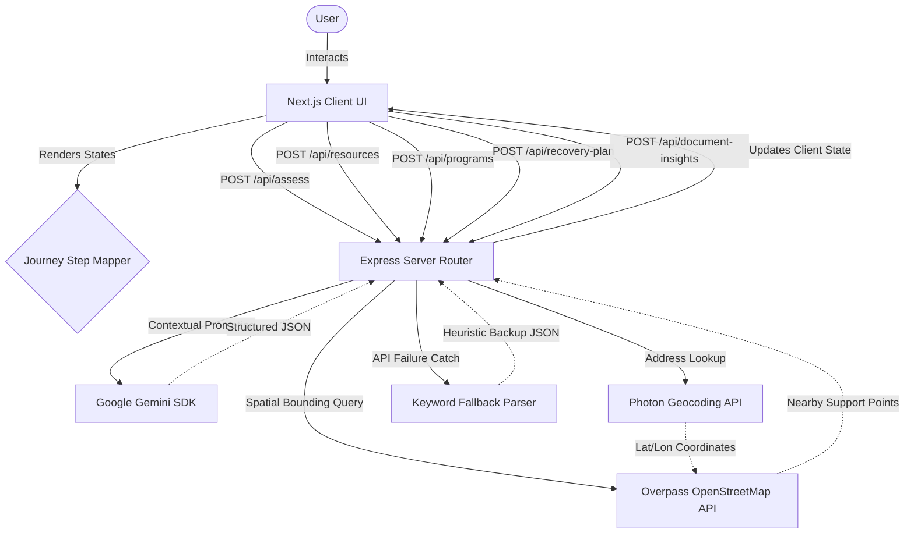

# LifeLine AI 🆘✨

**Empowering crisis recovery with compassionate, human-centered AI guidance.**

LifeLine AI is a specialized AI casework platform designed to help individuals navigate sudden life changes—such as job loss, food insecurity, or housing instability—with clarity, dignity, and practical next steps. Built for the **USAII Global AI Hackathon**, this platform demonstrates how large language models (LLMs) can move beyond simple chat and act as structured guides through the most difficult moments of a person's life.

---

## ⚡ Executive Summary (30-Second Overview)

* **What LifeLine AI Does**: An intelligent AI caseworker platform that converts chaotic, unstructured user stories of crisis into structured assessment data, matches users with real-world physical resource points, determines program eligibility, builds actionable recovery timelines, and translates resumes into immediate earning avenues.
* **Who It Helps**: Vulnerable individuals facing sudden financial or livelihood shocks, as well as non-profit intake coordinators and caseworker agents searching for intelligent tools to expedite intake assessments.
* **Why It Matters**: Institutions and safety nets are notoriously complex. During an emergency, people in panic cannot read endless pages of text or fill out dense multi-page forms. LifeLine AI bridges the gap by prioritizing survival first and then planning for stability.
* **What Makes It Different**: Unlike generic chatbots that leave users to navigate their own recovery, LifeLine AI uses a structured wizard-guided journey, backed by actual OpenStreetMap geolocated resources and a bulletproof, no-downtime heuristic fallback parser.

---

## 🚀 Innovation

### Why This Is Not a Traditional Chatbot
Traditional chatbots operate on open-ended dialog, which often increases cognitive load for users in crisis. LifeLine AI acts as a **structured caseworker**. It gathers facts silently in the background across seven critical assessment domains, evaluates risk level metrics, and dynamically computes a case's recovery category.

### How the AI Acts as a Structured Caseworker
Rather than giving dry links, the AI listens, validates the user's struggle, and asks exactly **one target question** at a time about the most urgent unknown information. It maintains context memory across multiple turns, preventing the user from repeating traumatic details.

### How Guided Recovery Workflows Improve Outcomes
By locking the assessment stage into a progressive sidebar map (Journey steps 1 through 6), the system ensures that immediate physical safety and food security needs are met before addressing long-term goals like employment. This mirrors professional social service procedures.

### Why Document-Driven Recommendations Are Useful
Instead of generic job search advice, the user uploads their resume. The system extracts hard skills, experiences, and provides:
1. **Immediate Income Opportunities**: Bridging gigs (e.g., freelance work, local service roles) with specific match scores.
2. **Career Growth Pathways**: High-potential long-term routes detailing the exact certifications and skill development steps required.

---

## 💎 Impact

### Potential Users & Social Value
In times of economic downturns, sudden layoffs, or natural disasters, millions of citizens struggle to locate emergency aid. LifeLine AI provides a compassionate, instant, and dignity-first front-door portal. It removes bureaucratic jargon, giving users immediate clarity on where to find a warm meal or shelter.

### Real-World Applicability
* **Job Loss**: Extracts resume skills, recommends immediate bridging gigs, and maps out training pathways.
* **Food Insecurity**: Leverages physical geolocated maps to direct hungry users to nearby food pantries and community kitchens.
* **Housing Instability**: Identifies local shelter nodes and guides users through late rent checkouts and eviction protection checklists.
* **Financial Emergencies**: Recommends public aid programs (like SNAP or Unemployment Benefits) and provides a clear list of the documents needed to apply.

### Scalability & Accessibility
* **Stateless Operations**: The backend runs as a serverless-friendly API, ensuring minimal hosting overhead and high scalability during regional emergencies.
* **Low-bandwidth Friendly**: Optimized client queries and light text extraction algorithms allow the app to operate smoothly on mobile web browsers over weak network signals.

---

## 📊 What Makes LifeLine AI Different

| Feature Focus | Traditional Chatbot | LifeLine AI Caseworker |
| :--- | :--- | :--- |
| **User Interaction** | Open-ended conversation (increases cognitive load) | Structured Wizard Journey prioritizing survival needs first |
| **Actionability** | Text advice and URLs to parse | Interactively completed Today / Week / Month checklist |
| **Resource Discovery** | AI-hallucinated lists or search index links | Real physical locations queried via Overpass OSM API |
| **Recovery Planning** | None (user must design their own steps) | Complete milestone plan with plain-text download |
| **Crisis Reasoning** | Generic prompt tuning | Heuristic priority ranking (Safety $\rightarrow$ Food $\rightarrow$ Housing $\rightarrow$ Job) |
| **Service Availability** | Crashes or times out if LLM API is down | **No-Downtime Fallback Parser** keeps guide running |

---

## 🎯 2-Minute Demo Flow (Judges' Guide)

1. **Step 1: Situation Shared**: The user describes their crisis in plain text (e.g., *"I lost my job and have no food for tomorrow in Kozhikode"*). The caseworker analyzes the text.
2. **Step 2: Needs Assessment**: The AI caseworker validates the user's struggle, flags risk levels, and extracts coordinates and facts. It guides the user through missing domains.
3. **Step 3: Resource Matching**: The app queries OpenStreetMap nodes within 10 km, rendering real, local community kitchens and shelters sorted by distance.
4. **Step 4: Program Recommendations**: Matches the user's crisis parameters against benefit rules (e.g., SNAP, Unemployment Benefits), mapping the exact documents required.
5. **Step 5: Recovery Roadmap**: Generates a clear, actionable recovery checklist grouped by Today, This Week, and This Month, available to download as a text file.
6. **Step 6: Document Upload & Insights**: The user uploads their resume (`.txt`). The AI extracts core skills and returns immediate gig work matches and long-term career growth paths.

---

## ⚙️ Technical Highlights

* **Next.js Frontend (React 19)**: Built with Next.js 16 App Router, styled with Tailwind CSS v4, and integrated with shadcn/ui components.
* **Express Backend**: Secured proxy layer written in TypeScript 6 that handles environment variables and API routing safely.
* **Gemini AI Integration**: Powered by `gemini-2.5-flash` utilizing JSON schema configurations (`responseMimeType: "application/json"`) for structured responses.
* **Resource Discovery Engine**: Uses Photon Komoot geocoding and the Overpass OpenStreetMap API to query real-world coordinates and rotate between multiple interpreter mirrors.
* **Recovery Planning Engine**: Organizes step-by-step checklists with progress bar updates and offline file downloads.
* **Resume Intelligence**: Reads raw client-side text files to extract skills and compile match scores for temporary and growth jobs.
* **Fallback AI System**: A regex-based parser that executes heuristically if the Gemini API fails, maintaining uninterrupted service.
* **Structured Caseworker Workflow**: Priority classification logic: Safety Risk $\rightarrow$ Food $\rightarrow$ Housing $\rightarrow$ Medical $\rightarrow$ Transportation $\rightarrow$ Employment.

---

## 🏗️ Architecture Diagram




---

## 🔌 API Documentation

### 1. Health Check
* **Route**: `GET /`
* **Purpose**: Confirm server status.
* **Response Payload (200 OK)**:
  ```json
  {
    "message": "LifeLine Backend Running"
  }
  ```

### 2. Case Assessment
* **Route**: `POST /api/assess`
* **Request Payload**:
  ```json
  {
    "userMessage": "I lost my job and have no food in Kozhikode.",
    "history": [],
    "caseState": {
      "currentSituation": "",
      "primaryConcern": "",
      "riskLevel": "medium",
      "identifiedNeeds": [],
      "answeredQuestions": [],
      "currentStep": 1,
      "category": "Crisis Assessment",
      "assessmentData": {}
    }
  }
  ```
* **Response Payload (200 OK)**:
  ```json
  {
    "acknowledgment": "I am so sorry to hear you're going through this.",
    "reasoning": {
      "primaryConcern": "Food Insecurity",
      "riskLevel": "medium",
      "identifiedNeeds": ["Food Assistance", "Employment Support"],
      "missingInformation": ["Dependents", "Medical Needs"]
    },
    "response": "I've recorded that you are in Kozhikode. Are you currently looking for food assistance, or do you have any dependents to care for?",
    "nextQuestions": ["Are you looking for immediate food assistance today?"],
    "updatedCaseState": {
      "currentSituation": "User lost job and lacks food. Lives in Kozhikode.",
      "primaryConcern": "Food Insecurity",
      "riskLevel": "medium",
      "identifiedNeeds": ["Food Assistance", "Employment Support"],
      "answeredQuestions": ["Location resolved"],
      "currentStep": 2,
      "category": "Food Security Recovery",
      "assessmentData": {
        "employment": "Unemployed",
        "foodSecurity": "Experiencing food insecurity",
        "housing": "Unknown",
        "dependents": "Unknown",
        "medical": "Unknown",
        "location": "Kozhikode",
        "transportation": "Unknown"
      }
    }
  }
  ```

### 3. Program Guidance
* **Route**: `POST /api/programs`
* **Request Payload**:
  ```json
  {
    "situation": "Unemployed developer with food insecurity in Kozhikode.",
    "answers": {
      "Are you looking for immediate food assistance?": "Yes"
    }
  }
  ```
* **Response Payload (200 OK)**:
  ```json
  {
    "programs": [
      {
        "name": "SNAP (Supplemental Nutrition Assistance Program)",
        "match": "Strong Match",
        "reason": "Provides direct support for grocery budgets to households with low income or sudden employment loss.",
        "documents": ["Government ID", "Proof of address", "Termination letter"]
      }
    ]
  }
  ```

### 4. Recovery Plan
* **Route**: `POST /api/recovery-plan`
* **Request Payload**:
  ```json
  {
    "situation": "Unemployed developer with food insecurity in Kozhikode."
  }
  ```
* **Response Payload (200 OK)**:
  ```json
  {
    "today": [
      { "title": "Locate nearby food pantry", "description": "Visit local community kitchen to secure meals." }
    ],
    "thisWeek": [
      { "title": "File for unemployment benefits", "description": "Submit separation letters to the state platform." }
    ],
    "thisMonth": [
      { "title": "Draft emergency budget", "description": "Review outstanding rent/bill obligations." }
    ]
  }
  ```

### 5. Document Insights
* **Route**: `POST /api/document-insights`
* **Request Payload**:
  ```json
  {
    "resumeText": "Experienced factory loader with logistics background. Certified forklift operator."
  }
  ```
* **Response Payload (200 OK)**:
  ```json
  {
    "skills": ["Factory Loading", "Logistics", "Forklift Operation"],
    "experience": "Logistics and heavy machinery operations.",
    "temporaryOpportunities": [
      {
        "title": "Warehouse Logistics Specialist",
        "matchScore": 95,
        "rationale": "Directly matches forklift operations certification.",
        "matchPoints": ["Forklift Operation", "Logistics"]
      }
    ],
    "growthOpportunities": [
      {
        "title": "Operations Manager",
        "matchScore": 85,
        "rationale": "Logical transition step using your logistics experience.",
        "matchPoints": ["Logistics background"]
      }
    ]
  }
  ```

### 6. Local Support Resources
* **Route**: `POST /api/resources`
* **Request Payload**:
  ```json
  {
    "location": "Kozhikode",
    "identifiedNeeds": ["Food Assistance"]
  }
  ```
* **Response Payload (200 OK)**:
  ```json
  {
    "resources": [
      {
        "name": "Kozhikode Community Kitchen",
        "category": "Food Assistance",
        "address": "Link Road, Kozhikode",
        "distance": "1.2 km away",
        "description": "Free community hot meals daily.",
        "lat": 11.25,
        "lng": 75.78
      }
    ],
    "fallbackActive": false,
    "fallbackMessage": null
  }
  ```

---

## 💾 Data Models

Defined in [types/index.ts](file:///home/pirate/LifeLine/frontend/src/types/index.ts):

### 1. `Resource`
```typescript
export interface Resource {
  id: string;
  name: string;
  type: 'food' | 'housing' | 'employment' | 'legal';
  distance: string;
  address: string;
  openNow: boolean;
  statusText?: string;
  phone?: string;
  description: string;
  priority: UrgencyLevel;
  category?: string;
}
```

### 2. `Program`
```typescript
export interface Program {
  id: string;
  name: string;
  description: string;
  recommendationReason: string;
  requirements: string[];
  confidence: UrgencyLevel;
  link: string;
}
```

### 3. `RecoveryStep`
```typescript
export interface RecoveryStep {
  id: string;
  title: string;
  description: string;
  completed: boolean;
  timeframe: 'today' | 'week' | 'month';
}
```

### 4. `DocumentInsight`
```typescript
export interface DocumentInsight {
  id: string;
  fileName: string;
  skills: string[];
  experience: string;
  opportunities: {
    temporary: string[];
    growth: string[];
  };
}
```

### 5. `CaseState`
```typescript
export interface CaseState {
  currentSituation: string;
  primaryConcern: string;
  riskLevel: UrgencyLevel;
  identifiedNeeds: string[];
  answeredQuestions: string[];
  currentStep: number;
  assessmentData?: {
    employment?: string;
    foodSecurity?: string;
    housing?: string;
    dependents?: string;
    medical?: string;
    location?: string;
    transportation?: string;
  };
}
```

---

## ⚙️ Environment Variables

Copy the template from [.env.example](file:///home/pirate/LifeLine/.env.example) to set up configuration:

| Variable Name | Purpose | Required/Optional | Example Value |
| :--- | :--- | :---: | :--- |
| `PORT` | Listening port of Express backend. | Optional (Default: `5000`) | `5000` |
| `GEMINI_API_KEY` | Key for Google Gemini SDK. | **Required** | `AIzaSyD...` |
| `GEMINI_MODEL` | Generative model variant. | **Required** | `gemini-2.5-flash` |
| `NEXT_PUBLIC_API_BASE_URL` | Base API URL used by the client. | **Required** | `http://localhost:5000` |

---

## 🚀 Installation Guide

### Prerequisites
* Node.js v18 or higher.
* NPM package manager.
* A Google Gemini API Key ([Get one here](https://ai.google.dev/)).

### Clone the Repository
```bash
git clone https://github.com/vijaygovindBiju/Lifeline.git
cd Lifeline
```

### Configuration
Create a `.env` file in the root workspace folder:
```bash
cp .env.example .env
```
Open `.env` and insert your API key:
```ini
GEMINI_API_KEY=YOUR_ACTUAL_API_KEY_HERE
```
Then copy keys to local client and server directories:
```bash
cp .env frontend/.env.local
cp .env backend/.env
```

### Unified Execution (Root Script)
To install dependencies and start both servers concurrently:
```bash
# Install dependencies across root, backend, and frontend
npm run install-all

# Start both developer builds concurrently
npm run dev
```
The application will launch at `http://localhost:3000`.

### Manual Setup (Separate Terminals)

#### 1. Backend Server Setup
```bash
cd backend
npm install
npm run dev
```
The API server will listen on `http://localhost:5000`.

#### 2. Frontend Next.js Setup
```bash
cd ../frontend
npm install
npm run dev
```
The Next.js client interface will launch on `http://localhost:3000`.

---

## 📂 Project Structure

```text
├── backend/                  # Node.js/Express API Application
│   ├── dist/                 # Compiled production files
│   ├── src/
│   │   ├── app.ts            # Endpoint route handling and fallback controllers
│   │   └── server.ts         # Server boot configuration
│   ├── package.json          # Backend dependencies
│   └── tsconfig.json         # TypeScript compiler instructions
├── frontend/                 # Next.js Client Application
│   ├── src/
│   │   ├── app/
│   │   │   ├── globals.css   # Tailwind styling system configuration
│   │   │   ├── layout.tsx    # Next.js base structural layout wrapper
│   │   │   └── page.tsx      # Main wizard interface managing workflow state
│   │   ├── components/
│   │   │   ├── layout/       # App layout frameworks (AppLayout.tsx)
│   │   │   ├── shared/       # Cards, chatbots, checklist components
│   │   │   └── ui/           # Primitive shadcn/ui components
│   │   ├── data/
│   │   │   ├── mockData.ts   # Dev data fallbacks
│   │   │   └── resources.ts  # Static test targets
│   │   ├── lib/              # Styling utils helper scripts
│   │   └── types/
│   │       └── index.ts      # TypeScript interfaces
│   ├── package.json          # Frontend packages and build scripts
│   └── tsconfig.json         # TypeScript configuration
├── scripts/                  # Automated verification routines
│   ├── check_models.js       # Checks Gemini API configuration and status
│   └── final_validation.py   # Simulates an end-to-end user session
├── package.json              # Monorepo setup script configuration
└── .env.example              # Workspace variables layout guide
```

---

## 🧠 Design Decisions

* **Why Decoupled Client-Server?**
  * Client-side keys are easily scraped. Proxing requests through the Node.js Express server keeps the `GEMINI_API_KEY` secure.
* **Why Next.js App Router & Tailwind CSS v4?**
  * Next.js App Router provides fast page loading and clean component isolation. Tailwind CSS v4 offers rapid, fluid styling with CSS variables.
* **Why the Compassionate Wizard User Flow?**
  * Open chat interfaces can increase cognitive load during emergencies. A structured workflow ensures immediate needs (food/housing) are resolved first before long-term reskilling is discussed.
* **Why Heuristic Fallback Systems Exist?**
  * Vulnerable users cannot afford app crashes. If the Gemini API fails, the backend keyword parser takes over to keep the application running.
* **Trade-Offs Made**:
  * *TXT File Parsing*: Resumes are parsed as `.txt` files rather than binary `.pdf`/`.docx` files. This avoids server-side memory overhead and heavy parser dependencies, focusing the application on validating the AI extraction and matching pipeline.
  * *Client-Side FileReader*: Reads files inside the client's browser sandbox, reducing file size burdens on the Express API.

---

## 🛡️ Security & Compliance

* **API Key Handling**: API keys are saved exclusively in the server environment. The client only queries the API via CORS-safe endpoints.
* **Data Privacy Considerations**: LifeLine operates on a stateless model. It does not record personal logs, chats, or resume data in persistent databases, protecting user privacy.
* **User Safety Protections**: If the AI engine flags high-risk input (or if the regex scans keywords like *suicide*, *harm*, *abuse*, *violence*, *hurt*), the application displays an amber notice directing the user to dial 911.
* **AI Limitations Disclaimers**: Disclaimers are embedded across all outputs, informing users that the tool is informational and matches must be verified with official county offices.

---

## 🔍 Challenges & Solutions

### 1. AI Resource Hallucinations
* *Challenge*: Standard LLMs tend to make up names, addresses, and telephone numbers when asked for local resources.
* *Solution*: The backend uses real spatial data. The coordinates are geocoded using the Komoot Photon API, and actual locations are pulled from OpenStreetMap via the Overpass API.

### 2. Overpass API Failures
* *Challenge*: OpenStreetMap Overpass servers are public assets and occasionally drop requests or timeout.
* *Solution*: The backend implements mirror rotation. It stores an array of interpreter servers and rotates if a connection times out (using a 10-second AbortSignal).

### 3. Gemini Outages & API Rate Limits
* *Challenge*: API rate limitations or lack of connection shouldn't break the application.
* *Solution*: The server implements a regex-based caseworker fallback parser. It extracts keywords locally and populates matching JSON responses.

### 4. Category Security
* *Challenge*: The app should not assume job loss or crisis states without sufficient information.
* *Solution*: The backend uses a post-processing step with a strict priority order (Safety -> Food -> Housing -> Medical -> Transportation -> Employment) and keeps the state as "Crisis Assessment" (neutral starting state) until the location is resolved.

---

## 🗺️ Future Vision & Roadmap

```text
[County Intake API Integration] ➔ [Offline Mobile Support] ➔ [Multilingual Translation Engine]
```

* **County Intake API Integration**: Connect to local social security platforms to pre-fill benefits forms (SNAP/TANF/Unemployment) directly from case intake histories.
* **Offline Mobile Support**: Implement Service Workers and local SQLite database stores to cache nearby resource maps offline for users with intermittent network access.
* **Multilingual Translation Engine**: Support voice-to-text queries in regional languages, opening assistance to non-English speaking households.

---

## 🛠️ Development Insights

* **Built Manually**:
  * The layout system and dynamic state progression in Next.js.
  * The local caseworker regex parsing engine and priorities logic.
  * The Overpass spatial lookup queries and server rotation mechanism.
* **AI-Assisted**:
  * Boilerplate structures for Next.js components.
  * Validation parameters for JSON schema definitions.
  * Distance calculations (Haversine formula).
* **Human Oversight Applied**:
  * Enforced emergency disclaimers across all screens.
  * Prioritized safety (911 warnings) over career options.
  * Enforced location verification before assigning crisis categories.

---

*LifeLine AI: One decision at a time.*
